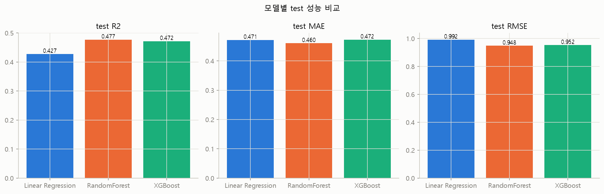
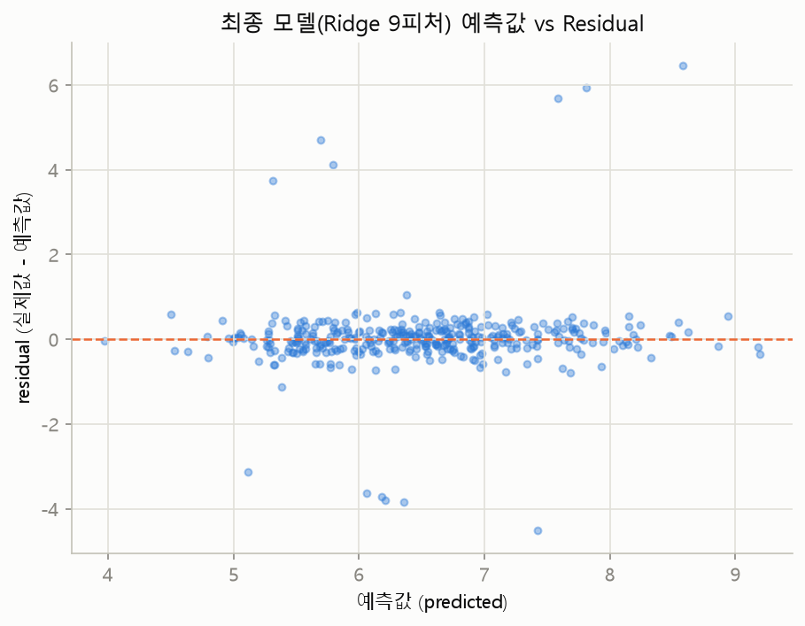

<!-- title: AI-Assisted Drug Discovery Data Analysis with Claude Code -->
# AI-Assisted Drug Discovery Data Analysis with Claude Code

> Binding Affinity Prediction and Model Validation on a Virtual Screening Dataset

This repository demonstrates an end-to-end bio-data analysis workflow — data quality assessment, EDA, modeling, cross-validation, and residual analysis — performed using [Claude Code](https://claude.com/product/claude-code) as a coding and analysis tool, with every data-quality judgment, statistical decision, and interpretation directed and validated by the researcher. The goal is not "Claude Code built a model." It is: **Claude Code was used to execute a rigorous, iterative analysis, while the research questions, validity checks, and final judgment stayed with the researcher.**

## Table of Contents

- [Project Snapshot](#project-snapshot)
- [What I Demonstrated](#what-i-demonstrated)
- [Key Results](#key-results)
- [Analysis Workflow](#analysis-workflow)
- [Key Findings](#key-findings)
- [Experiment Log](#experiment-log)
- [Model Comparison](#model-comparison)
- [Critical Limitation](#critical-limitation)
- [Claude Code Workflow](#claude-code-workflow)
- [Human vs AI](#human-vs-ai)
- [Biological Context](#biological-context)
- [Reproducibility](#reproducibility)
- [Repository Structure](#repository-structure)
- [Next Experiment](#next-experiment)
- [Detailed Documentation](#detailed-documentation)

## Project Snapshot

- **Dataset:** 2,000 compound-protein pairs (1,825 after quality filtering)
- **Task:** Binding affinity regression
- **Workflow:** Data QC → EDA → Modeling → Cross-validation → Residual analysis
- **Best model:** Ridge Regression (9 features, `StandardScaler`)
- **CV R²:** 0.5714 ± 0.0681 (baseline 7-feature Linear Regression: 0.4552 ± 0.0577)
- **Key finding:** High-affinity compounds were systematically underpredicted, in both the baseline and the final model
- **Main purpose:** Demonstrate an AI-assisted, researcher-validated end-to-end bio-data analysis workflow

## What I Demonstrated

- **Claude Code–assisted, end-to-end data analysis** — every stage from raw-file inspection to the final residual check was executed through Claude Code, directed step by step rather than run as a single automated pipeline.
- **Data quality assessment** — checked the raw file for duplicates, disguised missing values, and inconsistent types before any modeling (`scripts/01_eda_structure_overview.py`).
- **Missing value / outlier handling** — identified 8.7% of rows with missing values and one physically impossible value (`polar_surface_area` = -24.65), and made an explicit keep/drop decision for each (`scripts/02_preprocessing.py`).
- **Data leakage detection** — found that the `active` column is an exact binarization of the target and removed it before modeling — see [Critical Limitation](#critical-limitation) and [Key Findings](#key-findings).
- **Exploratory data analysis** — ranked every feature's correlation with the target and flagged multicollinear pairs before selecting a feature set (`scripts/03`–`05`).
- **Feature engineering** — tested an explicit `logp`×`protein_pi` interaction term, and evaluated Ridge regularization as a way to reintroduce correlated features that had been excluded from the interpretable baseline (`scripts/13`–`15`).
- **Regression model comparison** — compared Linear Regression, RandomForest, and XGBoost under identical split conditions (`scripts/07`, `09`–`11`).
- **Cross-validation** — re-tested single-split model rankings with 5-fold CV, which reversed an initial (incorrect) conclusion about which model was best (`scripts/12`, `14`).
- **Residual analysis** — checked not just aggregate error but *where* the model was wrong, on both the baseline and the final model (`scripts/08`, `16`).
- **Model limitation assessment** — scoped the final model's practical use based on the residual findings, rather than reporting R² alone.
- **Reproducible workflow documentation** — every script is numbered in execution order, and every decision is logged in [`docs/WORKFLOW.md`](docs/WORKFLOW.md).

## Key Results

```text
Ridge Regression

7 features
CV R² ≈ 0.455

        ↓ Feature re-evaluation

9 features
CV R² ≈ 0.571
```

Two features (`logp_pi_interaction`, `mw_ratio`) were initially excluded from the baseline model based on multicollinearity concerns (correlation ≥ 0.8 with other features), to keep the first model's coefficients individually interpretable. Ridge regression — which regularizes coefficient magnitude rather than requiring manual exclusion — was then evaluated as an alternative. Reintroducing the two excluded features into a Ridge model raised cross-validated R² from 0.4552 ± 0.0577 to 0.5714 ± 0.0681, a gap larger than either model's fold-to-fold standard deviation.

## Analysis Workflow

```text
Raw Data (data/raw/)
   ↓
Data Quality Check              → scripts/01_eda_structure_overview.py
   ↓
Preprocessing                   → scripts/02_preprocessing.py
   ↓
EDA                             → scripts/03_eda_binding_affinity.py
                                   scripts/04_eda_all_numeric_features.py
                                   scripts/05_correlation_analysis.py
   ↓
Baseline Modeling               → scripts/06_train_test_split.py
                                   scripts/07_linear_regression.py
   ↓
Model Comparison                → scripts/09_random_forest.py
                                   scripts/10_xgboost.py
                                   scripts/11_model_comparison.py
   ↓
Cross-Validation                → scripts/12_cross_validation.py
   ↓
Feature / Model Optimization    → scripts/13_next_steps.py
                                   scripts/14_next_steps_cv_check.py
                                   scripts/15_final_model.py
   ↓
Residual Analysis                → scripts/08_residual_analysis.py (baseline)
                                    scripts/16_final_model_residual_analysis.py (final model)
   ↓
Practical Assessment            → this README (Critical Limitation), docs/next_experiment.md
```

## Key Findings

### 1. Data quality

Missing values in `logp`, `polar_surface_area`, and `hydrophobicity` (3.0% each) barely overlapped, so together they affected 174 rows (8.7%). A separate scan also found one physically impossible value — `polar_surface_area` = -24.65 (surface area cannot be negative). Both were resolved by dropping the affected rows (2,000 → 1,825). No duplicate rows or disguised-missing tokens were found.

### 2. Data leakage

The `active` column turned out to be an exact binarization of the target: `active = 1` if and only if `binding_affinity > 7.0` (active=0 max was 6.996; active=1 min was 7.002 — no overlap). Using it as a feature would have let the model see the answer. It was excluded from all modeling.

### 3. Model performance

A single 8:2 split made RandomForest and XGBoost look better than Linear Regression. Five-fold cross-validation showed this was not a reliable difference — all three models' R² distributions overlapped once fold-to-fold variability was accounted for. The only change that produced a statistically meaningful improvement was reintroducing two multicollinear features into a Ridge model (see [Key Results](#key-results)).

### 4. Model limitation

Residual analysis on the held-out test set showed `corr(residual, actual value)` = 0.77 for the baseline model and 0.74 for the final model — in both cases, the model underpredicts high-affinity compounds and overpredicts low-affinity ones. The Ridge model's overall R² improvement did not resolve this bias, which limits its practical use — see [Critical Limitation](#critical-limitation).

## Experiment Log

| Experiment | Approach | Result | Decision |
|---|---|---|---|
| Baseline | Linear Regression, 7 features | CV R² = 0.4552 ± 0.0577 | Baseline established |
| Model comparison | RandomForest | CV R² = 0.4887 ± 0.0816 | Compared — no statistically meaningful gain over baseline |
| Model comparison | XGBoost | CV R² = 0.4915 ± 0.0900 | Compared — no statistically meaningful gain over baseline or RandomForest |
| Feature engineering | `logp`×`protein_pi` interaction term | CV R² = 0.4647 ± 0.0454 | What was learned: the interaction alone did not meaningfully improve fit — rejected for the final model |
| Data split strategy | Group split by `protein_id` | Test R² = 0.4470, comparable to the random split | What was learned: no evidence that the random split's protein overlap inflated performance |
| Regularization | Ridge, same 7 features | CV R² = 0.4552 ± 0.0577 (unchanged) | No effect at default `alpha=1.0` on this feature set |
| Regularization + feature reintroduction | Ridge, 9 features (+`logp_pi_interaction`, +`mw_ratio`) | CV R² = 0.5714 ± 0.0681 | Selected as final model |
| Residual analysis | Final model, held-out test set | High-affinity compounds still underpredicted (`corr(residual, actual)` = 0.7358) | What was learned: the R² gain did not fix this bias — usage scope limited accordingly |

This table reflects an **iterative research workflow**: each experiment's result determined the direction of the next one, rather than following a fixed plan set at the start.

## Model Comparison

| Model | CV R² (mean ± std) | Test R² (single split) | Test MAE | Test RMSE |
|---|---|---|---|---|
| Linear Regression (baseline, 7 features) | 0.4554 ± 0.1036 | 0.4275 | 0.4714 | 0.9916 |
| RandomForest | 0.4887 ± 0.0816 | 0.4768 | 0.4603 | 0.9479 |
| XGBoost | 0.4915 ± 0.0900 | 0.4717 | 0.4724 | 0.9525 |
| Ridge (7 features) | 0.4552 ± 0.0577 | 0.4274 | 0.4716 | 0.9916 |
| **Ridge (9 features, final model)** | **0.5714 ± 0.0681** | **0.5533** | **0.3700** | **0.8759** |

*Note: the Linear Regression/RandomForest/XGBoost row is from one 5-fold CV pass (`scripts/12`); the Ridge experiment rows are from a second 5-fold CV pass on the same 1,825-row dataset with a different row ordering (`scripts/14`), which is why the baseline's CV mean appears twice with a small difference (0.4554 vs 0.4552) — both are valid estimates of the same model, not a computation error.*

Full result files: [`output/day6/final/cross_validation_results.csv`](output/day6/final/cross_validation_results.csv), [`output/day6/final/next_steps_cv_results.csv`](output/day6/final/next_steps_cv_results.csv), [`output/day6/final/model_comparison.png`](output/day6/final/model_comparison.png)



## Critical Limitation



The plot above (final model, held-out test set) is the clearest evidence of the main limitation: most points cluster tightly around zero residual, but a distinct set of large errors remains — these correspond to compounds whose actual affinity was far higher or far lower than the model predicted, which is exactly the pattern behind the `corr(residual, actual)` = 0.74 reported in [Key Findings](#key-findings).

- **The dataset is simulated, not experimental.** `data/raw/drug_discovery_virtual_screening.csv` is a virtual-screening dataset (see [Data Source](#detailed-documentation)) — computationally generated, not measured in a lab.
- **No external validation.** All reported metrics come from splits of this single dataset (random and group-based); the model has not been evaluated on any independent dataset.
- **The feature set is limited to basic molecular/protein descriptors** (molecular weight, logP, protein length, isoelectric point, etc.) — no structural or docking-derived features were used.
- **High-affinity compounds are systematically underpredicted** (`corr(residual, actual)` ≈ 0.74–0.77 across all model variants tested). This is the same failure mode observed in every model in this project, including the final one.

**As a result, this model is not appropriate for final drug candidate ranking or any real drug-development decision.** The model is better positioned as a preliminary filtering tool — for deprioritizing candidates it confidently predicts as weak binders — rather than a final candidate-ranking model. See [`docs/biological_context.md`](docs/biological_context.md) for how this fits into a real screening workflow, and [`docs/next_experiment.md`](docs/next_experiment.md) for what would need to change before the high-affinity bias could be addressed.

## Claude Code Workflow

```text
Research Question
      ↓
Prompt / Instruction
      ↓
Claude Code
      ↓
Code Generation / Analysis
      ↓
Result Inspection
      ↓
Researcher Validation
      ↓
Next Analysis Decision
```

Each stage of this project followed this loop: a specific question was posed, Claude Code generated the code and ran the analysis, and the researcher inspected the actual output (numbers, tables, plots) before deciding whether to accept the result and move on, or change direction. The cross-validation step in this project is a direct example: single-split results were not accepted at face value — they were re-tested, which changed the conclusion.

A step-by-step account of this loop for each analysis stage is in [`docs/CLAUDE_WORKFLOW.md`](docs/CLAUDE_WORKFLOW.md).

## Human vs AI

### Claude Code was used for

- Python code generation
- Data inspection
- Visualization
- Model implementation
- Repetitive analysis (re-running checks across models/feature sets)
- Documentation support

### Researcher decisions included

- Problem definition and success criteria
- Data quality criteria (what counts as missing, invalid, or duplicate)
- Data leakage assessment
- Preprocessing strategy (drop vs. impute, and at what threshold)
- Feature selection strategy (which multicollinear feature to keep, when to reintroduce both via regularization)
- Model comparison strategy (not trusting a single split; requiring cross-validation)
- Validation strategy (random vs. group split, and why both were checked)
- Biological interpretation (what the residual bias means for a screening use case)
- Final model selection
- Practical applicability assessment (preliminary filter vs. final ranking tool)

## Biological Context

Binding affinity prediction is used early in drug discovery to prioritize which computationally screened compounds are worth carrying into experimental testing — it is a filtering step, not a replacement for wet-lab validation. This project is a computational exercise only; no experimental work was performed here. See [`docs/biological_context.md`](docs/biological_context.md) for the full discussion, including how this model's limitations affect where it could realistically be used in that workflow.

## Reproducibility

### Environment

```bash
pip install -r requirements.txt
```

### Tools & Methods

**AI-assisted development**
- Claude Code

**Programming**
- Python

**Data Analysis**
- pandas
- NumPy
- matplotlib / seaborn

**Machine Learning**
- scikit-learn (Linear Regression, Ridge, RandomForest)
- XGBoost

**Validation**
- Train/test split (8:2, `random_state=42`)
- 5-fold cross-validation
- Residual analysis

### Execution order

Scripts are run from the repository root; script numbering (`01`–`16`) reflects the actual dependency order.

```bash
python scripts/01_eda_structure_overview.py
python scripts/02_preprocessing.py
python scripts/03_eda_binding_affinity.py
python scripts/04_eda_all_numeric_features.py
python scripts/05_correlation_analysis.py
python scripts/06_train_test_split.py
python scripts/07_linear_regression.py
python scripts/08_residual_analysis.py
python scripts/09_random_forest.py
python scripts/10_xgboost.py
python scripts/11_model_comparison.py
python scripts/12_cross_validation.py
python scripts/13_next_steps.py
python scripts/14_next_steps_cv_check.py
python scripts/15_final_model.py
python scripts/16_final_model_residual_analysis.py
```

All models use `random_state=42`, so running the scripts in order reproduces every result in `output/day6/`.

> **Font note**: charts use `Malgun Gothic` (Windows) for Korean text in a small number of plot labels. On macOS/Linux, change `plt.rcParams["font.family"]` in each script to an available Korean font (e.g., `AppleGothic`, `NanumGothic`) if those labels need to render correctly.

### Raw / Processed data

- `data/raw/` — original file, never modified.
- `data/processed/` — the cleaned dataset (`drug_discovery_virtual_screening_processed.csv`, 1,825 × 15) and the 8:2 train/test split (`split/train.csv`, `split/test.csv`) used for all single-split evaluations.

### Output

- `output/day6/figures/` — all generated charts.
- `output/day6/models/` — every trained model (`.pkl`) and metrics file produced during the project.
- `output/day6/final/` — a curated subset of the above (final model, key comparison tables, key figures) plus [`FINAL_RESULTS.md`](output/day6/final/FINAL_RESULTS.md), a one-page results summary, and [`INDEX.md`](output/day6/final/INDEX.md), a guide to what each file is.

## Repository Structure

```
.
├── README.md
├── CLAUDE.md
├── requirements.txt
├── data/
│   ├── raw/                          # Original file (never modified)
│   └── processed/                    # Cleaned dataset + train/test split
├── scripts/                          # Analysis scripts, 01-16 (execution order = dependency order)
├── output/
│   └── day6/
│       ├── figures/                  # All generated charts
│       ├── models/                   # Trained models (.pkl) + metrics
│       └── final/                    # Curated key results + FINAL_RESULTS.md + INDEX.md
└── docs/
    ├── WORKFLOW.md                   # Research decision log (chronological)
    ├── CLAUDE_WORKFLOW.md            # Representative Claude Code usage workflow
    ├── biological_context.md         # Where this fits in a real screening workflow
    ├── next_experiment.md            # Proposed (not yet run) follow-up experiments
    ├── problem_definition.md         # Original problem statement
    ├── reference/SOP.md              # General-purpose analysis procedure (reference)
    └── archive/                      # Unrelated prior project (archived, not part of this analysis)
```

## Next Experiment

The high-affinity underprediction bias identified in [Critical Limitation](#critical-limitation) is the main open problem. Proposed (not yet run) follow-ups include weighted/quantile regression aimed directly at that bias, XGBoost hyperparameter tuning, richer structural features, and external validation. Full details, including which metrics would actually measure improvement (Spearman correlation, Top-K recall), are in [`docs/next_experiment.md`](docs/next_experiment.md).

## Detailed Documentation

| Document | Contents |
|---|---|
| [`docs/WORKFLOW.md`](docs/WORKFLOW.md) | Full chronological research decision log |
| [`docs/CLAUDE_WORKFLOW.md`](docs/CLAUDE_WORKFLOW.md) | Representative Claude Code usage workflow, step by step |
| [`docs/biological_context.md`](docs/biological_context.md) | Why this problem matters, and where computational screening fits in a real workflow |
| [`docs/next_experiment.md`](docs/next_experiment.md) | Proposed follow-up experiments (not yet run) |
| [`docs/problem_definition.md`](docs/problem_definition.md) | Original problem statement |
| [`output/day6/final/FINAL_RESULTS.md`](output/day6/final/FINAL_RESULTS.md) | One-page results summary |
| [`output/day6/final/INDEX.md`](output/day6/final/INDEX.md) | Guide to the curated result files |

**Data source**: [Drug Discovery Virtual Screening Dataset](https://www.kaggle.com/datasets/shahriarkabir/drug-discovery-virtual-screening-dataset) (Kaggle, published by Shahriar Kabir) — a computationally generated virtual-screening dataset, not experimentally measured affinities.
