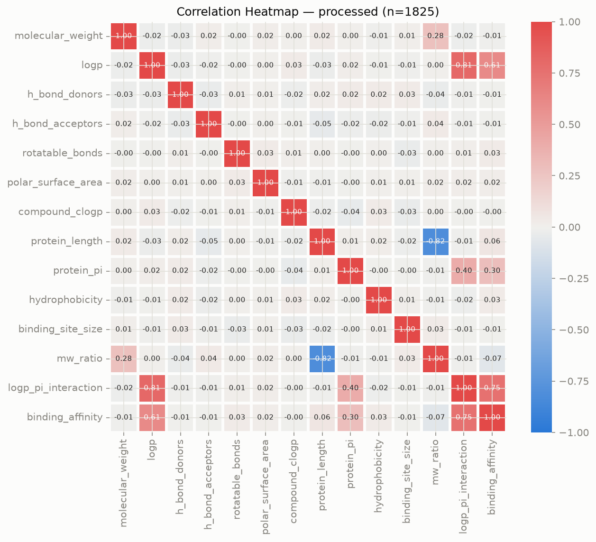
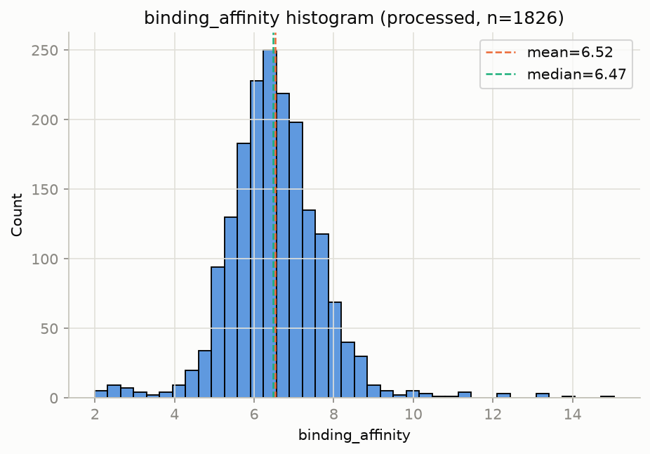

<!-- title: Drug-Protein Binding Affinity Prediction -->
# 약물-단백질 결합 친화도 예측 (Drug-Protein Binding Affinity Prediction)

가상 스크리닝(virtual screening) 데이터(2,000개 화합물-단백질 조합)를 이용해 **데이터 확인 → 정제 → 탐색적 분석(EDA) → 베이스라인 모델링 → 모델 비교/개선 → Residual 분석 → 문서화**까지 회귀분석 워크플로우 전체를 수행한 프로젝트입니다.

목표는 화합물-단백질 결합 친화도(`binding_affinity`)를 분자/단백질 특성으로 예측해, 신약 후보를 실험 전 컴퓨터로 1차 스크리닝하는 데 참고할 모델을 만드는 것입니다. 최종 모델은 **Ridge 회귀(9피처, StandardScaler)** 이며, 교차검증 기준 **R² = 0.5714 ± 0.0681**을 기록했습니다. 다만 모델은 스크리닝에서 가장 중요한 "결합력이 특히 높은 후보"를 여전히 과소예측하는 한계를 갖고 있습니다 — 자세한 내용은 [모델 성능 비교](#모델-성능-비교), [한계 및 유의사항](#한계-및-유의사항) 참고.

이 저장소는 결과 자체뿐 아니라, **[Claude Code](https://claude.com/product/claude-code)를 CLI 환경에서 활용해 이 워크플로우 전 과정을 수행한 방식**도 보여줍니다. 자세한 진행 기록은 [`docs/WORKFLOW.md`](docs/WORKFLOW.md)에 정리했습니다.

## 목차

- [데이터셋](#데이터셋)
- [프로젝트 구조](#프로젝트-구조)
- [분석 워크플로우](#분석-워크플로우)
- [모델 성능 비교](#모델-성능-비교)
- [핵심 인사이트](#핵심-인사이트)
- [한계 및 유의사항](#한계-및-유의사항)
- [재현 방법](#재현-방법)
- [Claude Code 활용 방식](#claude-code-활용-방식)
- [데이터 출처](#데이터-출처)

## 데이터셋

`data/raw/drug_discovery_virtual_screening.csv` — 가상 스크리닝(virtual screening) 시뮬레이션으로 생성된 화합물-단백질 결합 데이터. 2,000행 × 17열. 한 행은 화합물 하나와 단백질 하나의 조합입니다.

| 컬럼 | 설명 |
|---|---|
| compound_id | 화합물 식별자 |
| protein_id | 단백질 식별자 (400개 그룹, 화합물이 그룹당 평균 5개씩 묶임) |
| molecular_weight | 분자량 |
| logp | 지용성 지표(옥탄올-물 분배계수) |
| h_bond_donors | 수소결합 공여체 수 |
| h_bond_acceptors | 수소결합 수용체 수 |
| rotatable_bonds | 회전 가능한 결합 수 |
| polar_surface_area | 극성 표면적 |
| compound_clogp | 계산된 logP |
| protein_length | 단백질 길이(아미노산 수) |
| protein_pi | 단백질 등전점 |
| hydrophobicity | 단백질 소수성 지표 |
| binding_site_size | 결합 부위 크기 |
| mw_ratio | 분자량/단백질 길이 비율 (파생) |
| logp_pi_interaction | logp × protein_pi 상호작용 (파생) |
| **binding_affinity** | **결합 친화도 — 예측 타깃** |
| active | binding_affinity를 임곗값 7.0으로 이진화한 값. **target leakage라 분석에서 제외** |

## 프로젝트 구조

```
21차시/
├── data/
│   ├── raw/                          # 원본 (수정 금지)
│   └── processed/                    # 전처리본 + train/test 분할
├── scripts/                          # 분석 스크립트 (01~16, 실행 순서는 재현 방법 참고)
├── output/
│   └── day6/
│       ├── figures/                  # 차트 PNG
│       ├── models/                   # 학습된 모델(.pkl) + 지표 CSV
│       └── final/                    # 핵심 결과물만 모은 폴더 (INDEX.md 안내 포함)
├── docs/
│   ├── WORKFLOW.md                   # 진행 과정 기록 (시간순)
│   ├── problem_definition.md         # 문제 정의
│   └── reference/SOP.md              # 범용 분석 절차 (참고용)
├── requirements.txt
├── CLAUDE.md
└── README.md
```

## 분석 워크플로우

### 1. 데이터 확인 및 정제

결측치는 `logp`/`polar_surface_area`/`hydrophobicity`에 각 3.0%씩 있었으나 서로 거의 겹치지 않아 합집합 기준 174행(8.7%)에서 발생, 해당 행을 삭제했습니다. `polar_surface_area`에서 물리적으로 불가능한 음수값(-24.65) 1건을 추가로 발견해 결측 처리 후 삭제했습니다. 중복 행은 0건이었습니다.

가장 중요한 발견은 **`active` 컬럼이 `binding_affinity`를 임곗값 7.0으로 이진화한 완전한 파생값**이라는 것입니다(active=0 최댓값 6.996 / active=1 최솟값 7.002). 이를 피처로 쓰면 데이터 누수가 되므로 제외했습니다. 전처리 후 **2,000행 → 1,825행**, 15컬럼이 남았습니다.

### 2. 탐색적 분석 & 시각화

**상관관계 분석**
`binding_affinity`와 상관이 뚜렷한 변수는 `logp_pi_interaction`(r=0.751), `logp`(r=0.607), `protein_pi`(r=0.295)뿐이었고, 나머지 9개 변수는 모두 \|r\|<0.06으로 사실상 무관했습니다. 애초 목표 변수였던 `molecular_weight`도 r=-0.015로 예상과 달리 영향이 없었습니다. `logp`↔`logp_pi_interaction`(r=0.81), `protein_length`↔`mw_ratio`(r=-0.82) 두 쌍은 다중공선성이 확인돼 베이스라인 모델에서는 각 쌍의 원본만 사용했습니다.



**타깃 분포**
`binding_affinity`는 평균 6.522, 표준편차 1.205의 오른쪽으로 치우친 분포(skew 0.678)이며, 최댓값은 15.040까지 뻗어 있습니다. 이 오른쪽 꼬리(고결합력 후보)를 모델이 얼마나 잘 맞히는지가 이후 분석의 핵심 쟁점이 됩니다.



### 3. 모델링

`binding_affinity`를 예측하는 회귀 모델을 선형회귀(베이스라인) → 랜덤포레스트 → XGBoost 순으로 구축하고, **5-fold 교차검증**으로 재검증했습니다. 모든 모델은 `random_state=42`로 통일했습니다.

단일 분할 비교에서는 RandomForest·XGBoost가 선형회귀보다 나아 보였지만, 교차검증 결과 **세 모델의 성능 차이는 통계적으로 유의미하지 않았습니다**(R² std 0.08~0.10 범위 내). 이에 따라 추가로 3가지를 실험했습니다: ① `logp`×`protein_pi` 상호작용항 추가(유의미한 개선 없음), ② `protein_id` 기준 그룹 분할로 재검증(무작위 분할과 성능 비슷 — 새로운 단백질에도 일반화됨을 확인), ③ Ridge 회귀로 다중공선성 때문에 제외했던 `logp_pi_interaction`/`mw_ratio`를 재포함(**R² 0.46 → 0.57로 뚜렷한 개선**). 최종적으로 **Ridge(9피처, StandardScaler)** 를 최종 모델로 선정하고 전체 데이터로 재학습했습니다.


### 4. Residual 분석 — 핵심 한계

**모델은 결합력이 특히 높은 극단값을 체계적으로 과소예측합니다.** Baseline(corr(residual, 실제값)=0.773)과 최종 모델(corr=0.736) 모두에서 이 편향이 확인됐고, R²가 크게 개선된 뒤에도 거의 그대로 남았습니다. 최종 모델 기준 실제값 상위 10% 구간의 평균 residual은 +0.957로, 여전히 뚜렷한 과소예측입니다.


> ⚠️ 스크리닝의 목적이 "결합력 높은 후보를 놓치지 않는 것"임을 감안하면, 이 편향은 전체 R²보다 더 중요하게 다뤄야 할 한계입니다. RandomForest·XGBoost로 바꿔도 해결되지 않아, 현재 피처가 담고 있는 정보 자체의 한계로 보입니다.

## 모델 성능 비교

조건: `active`/`compound_id`/`protein_id` 제외, 5-fold 교차검증(`KFold(shuffle=True, random_state=42)`, 1,825행 전체) + 단일 분할(8:2, `random_state=42`) 병행 확인

| 모델 | CV R² (mean±std) | test R² (단일분할) | test MAE | test RMSE |
|---|---|---|---|---|
| Linear Regression (baseline, 7피처) | 0.4554 ± 0.1036 | 0.4275 | 0.4714 | 0.9916 |
| RandomForest | 0.4887 ± 0.0816 | 0.4768 | 0.4603 | 0.9479 |
| XGBoost | 0.4915 ± 0.0900 | 0.4717 | 0.4724 | 0.9525 |
| Ridge (7피처) | 0.4552 ± 0.0577 | 0.4274 | 0.4716 | 0.9916 |
| **Ridge (9피처, 최종 모델)** | **0.5714 ± 0.0681** | 0.5533 | 0.3700 | 0.8759 |

전체 지표(CSV): [`output/day6/final/next_steps_cv_results.csv`](output/day6/final/next_steps_cv_results.csv), [`output/day6/final/cross_validation_results.csv`](output/day6/final/cross_validation_results.csv)

## 핵심 인사이트

- `logp`가 사실상 유일하게 뚜렷한 단독 예측 신호이며, 애초 중요할 것으로 예상했던 `molecular_weight`는 타깃과 거의 무관했습니다.
- 단일 분할 비교에서는 RandomForest·XGBoost가 선형회귀보다 나아 보였지만, 5-fold 교차검증으로 재검증하니 **세 모델 모두 통계적으로 동률**이었습니다 — 단일 분할 비교만으로 모델 순위를 단정하면 안 된다는 걸 직접 확인했습니다.
- 다중공선성 때문에 제외했던 `logp_pi_interaction`/`mw_ratio`를 Ridge로 다시 포함시키자 성능이 크게 개선됐습니다(R² 0.46→0.57) — "계수를 해석하기 위한 모델"과 "예측 정확도를 높이기 위한 모델"은 피처 선택 기준이 다를 수 있음을 보여주는 사례입니다.
- `protein_id` 기준 그룹 분할(완전히 새로운 단백질로 테스트)로도 성능이 유지돼, 모델이 새로운 화합물뿐 아니라 새로운 단백질에도 비슷한 수준으로 일반화됨을 확인했습니다.
- 그러나 최종 모델도 고결합력 극단값에 대한 회귀-평균 편향(corr(residual, 실제값)=0.736)은 거의 해소하지 못했습니다 — 전체 설명력 개선과 이 문제의 해결은 별개였습니다.

## 한계 및 유의사항

- 최종 모델도 `binding_affinity` 변동의 약 43%를 설명하지 못합니다.
- 스크리닝에서 가장 중요한 고결합력 구간에서 가장 부정확합니다 — 유망 후보를 놓칠 위험이 있습니다.
- 교차검증에서 fold 간 R² 변동폭이 큽니다(baseline 기준 0.35~0.65) — 데이터 규모상 단일 분할 비교의 신뢰도는 낮습니다.
- Ridge의 `alpha`는 튜닝하지 않고 기본값(1.0)을 사용했습니다.
- `hydrophobicity` 상위 구간에서 오차가 커지는 패턴의 원인은 특정하지 못했습니다.
- 모든 검증은 이 데이터셋 내부 분할 기준이며, 외부 데이터로는 검증하지 않았습니다.

### 실전 활용 가능 여부

이 모델을 "예측 점수로 순위를 매겨 상위 후보만 골라 실험한다"는 방식으로 쓰면, 위 편향 때문에 진짜로 유망한 후보가 순위권 밖으로 밀려날 위험이 있습니다. 즉 **"결합력이 뛰어난 진짜 좋은 후보를 찾아내는" 최종 선별 도구로는 현재 상태로 적합하지 않습니다.**

다만 용도를 좁히면 활용 가치는 있습니다.

- 중간~낮은 구간(전체의 80%)에서는 편향이 거의 없어(평균 residual +0.013), **"예측이 낮으면 실제로도 낮을 가능성이 크다"**는 판단은 비교적 신뢰할 수 있습니다.
- 따라서 **명백히 가망 없는 후보를 대량으로 걸러내는 1차 필터**로는 쓸 수 있지만, 최종 후보 선정은 이 모델의 예측값에만 의존해서는 안 됩니다.
- 이 편향을 직접 겨냥한 개선(비대칭 손실 함수, 분위수 회귀, 극단값 오버샘플링)을 적용하지 않는 한, 최종 선별 용도로의 사용은 권장하지 않습니다.

## 재현 방법

```bash
pip install -r requirements.txt
```

스크립트는 프로젝트 루트에서 실행합니다(내부적으로 스크립트 위치 기준 상대 경로로 `data/`, `output/`을 참조). 스크립트 번호 순서(01~16)가 곧 의존관계 순서이므로, 아래처럼 순서대로 실행하면 됩니다.

```bash
python scripts/01_eda_structure_overview.py
python scripts/02_preprocessing.py
python scripts/03_eda_binding_affinity.py
python scripts/04_eda_all_numeric_features.py
python scripts/05_correlation_analysis.py
python scripts/06_train_test_split.py
python scripts/07_linear_regression.py
python scripts/08_residual_analysis.py
python scripts/09_random_forest.py
python scripts/10_xgboost.py
python scripts/11_model_comparison.py
python scripts/12_cross_validation.py
python scripts/13_next_steps.py
python scripts/14_next_steps_cv_check.py
python scripts/15_final_model.py
python scripts/16_final_model_residual_analysis.py
```

모든 모델이 `random_state=42`로 고정되어 있어, 위 순서대로 실행하면 `output/day6/`의 모든 결과(수치·차트)가 동일하게 재현됩니다.

> **폰트 참고**: 차트의 한글 표시에 Windows 기본 폰트인 `Malgun Gothic`을 사용합니다. macOS/Linux 등 다른 환경에서는 각 스크립트의 `plt.rcParams["font.family"]` 값을 시스템에 설치된 한글 폰트(예: `AppleGothic`, `NanumGothic`)로 바꿔야 한글이 정상적으로 표시됩니다.

## Claude Code 활용 방식

이 프로젝트의 데이터 확인, 정제 방침 결정, EDA, 모델링, 검증, 결과 해석, 문서화는 모두 **Claude Code CLI 환경에서 자연어 대화로 지시하며** 진행했습니다. 예를 들어:

- 데이터를 먼저 "회귀분석이 가능한 데이터인지" 읽기 전용으로 판정한 뒤에 전처리를 진행하도록 순서를 지정했습니다.
- 컬럼 삭제·값 변경은 매번 방법(안)을 먼저 제시받고 확인한 뒤에만 실행하도록 진행했습니다.
- 단일 분할에서 RandomForest·XGBoost가 나아 보였을 때, 교차검증으로 재검증해달라는 요청에 따라 실제로는 세 모델이 통계적으로 동률임을 확인했습니다.
- 다중공선성 때문에 제외했던 피처를 Ridge로 되살려보자는 지시에 따라 성능을 0.46→0.57로 크게 개선했습니다.
- 최종 모델도 별도로 residual analysis를 다시 요청해, R² 개선과 별개로 핵심 한계(극단값 편향)가 남아있음을 직접 검증했습니다.
- 매 작업 단계를 [`docs/WORKFLOW.md`](docs/WORKFLOW.md)에 누적 기록하며 진행 상황과 판단 근거를 추적했습니다.

## 데이터 출처

[Drug Discovery Virtual Screening Dataset](https://www.kaggle.com/datasets/shahriarkabir/drug-discovery-virtual-screening-dataset) (Kaggle, Shahriar Kabir 게시) — 컴퓨터 기반 가상 스크리닝(computational virtual screening)으로 생성된 화합물-단백질 결합 데이터. 실제 실험 측정값이 아니라 시뮬레이션 데이터입니다.
